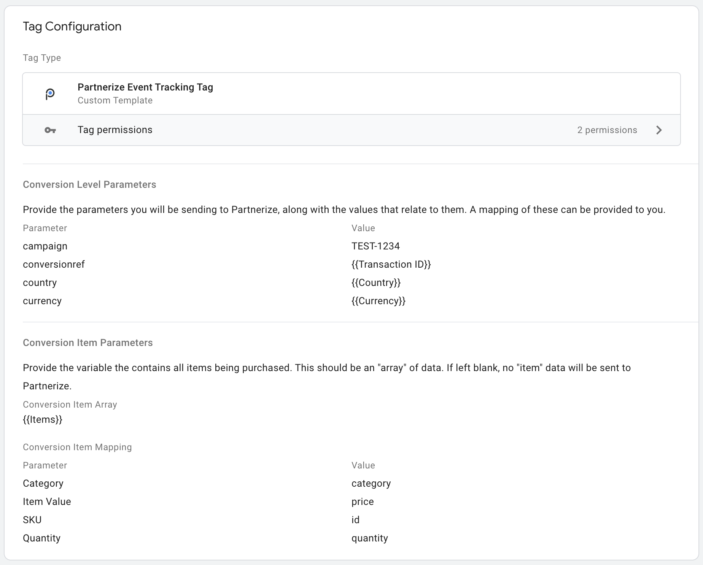

# Partnerize Event Tracking Tag
This tag will allow you to send data to Partnerize using a guided form template.

## Requirements

**Mapped Variables**

Each data point you want to send to Partnerize in this tag does need to be configured inside Google Tag Manager. Since there is no structured format, it will not grab data without it being mapped in the Tag configuration.

**Item Data**

Item data must be provided in an `array` format. You will then be able to map the item property names:
+ category
+ sku
+ quantity
+ value

Any other item data available for each item will then be included as custom metadata points.

## Configuration
You will be provided with a sample mapping table from the Partnerize Integration team. This will help you understand what GTM Variables need to go in each Partnerize parameter during configuration.

**Examples**

Tag Configuration Mapping

_Sample dataLayer_
```
{
    "countryCode": "US",
    "stateCode": "XX",
    "currencyCode": "USD",
    "purchase": {
        "actionField": {
            "id": "WEB-1529385901628095959",
            "affiliation": "Web Store",
            "revenue": "39.98",
            "tax": "2.4",
            "shipping": "4.99",
            "coupon": ""
        },
        "products": [
            {
                "pid": "2",
                "id": "DEF5678",
                "name": "Killer Shirts",
                "price": "29.99",
                "category": "Clothing",
                "quantity": 1,
                "full_price": "29.99"
            },
            {
                "pid": "4",
                "id": "JKL3456",
                "name": "Killer Socks",
                "price": "9.99",
                "category": "Accessories",
                "quantity": 1,
                "full_price": "9.99"
            }
        ]
    }
}
```

_Screenshot_


_Sample Output_
```
/conversion/campaign:TEST-1234/conversionref:WEB-1529385901628095959/country:US/currency:USD/[category:Clothing/value:29.99/sku:DEF5678/quantity:1/pid:2/name:Killer%20Shirts/full_price:29.99/][category:Accessories/value:9.99/sku:JKL3456/quantity:1/pid:4/name:Killer%20Socks/full_price:9.99/]
```
Each of the variables are pulled into the Partnerize tracking syntax based on the data available in the [Variables](https://support.google.com/tagmanager/topic/7683268?hl=en&ref_topic=3441647) and static values.